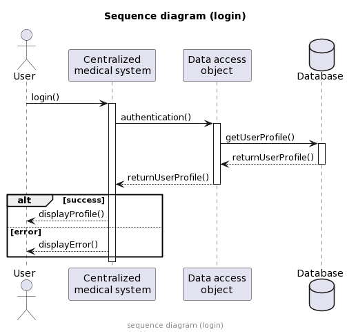
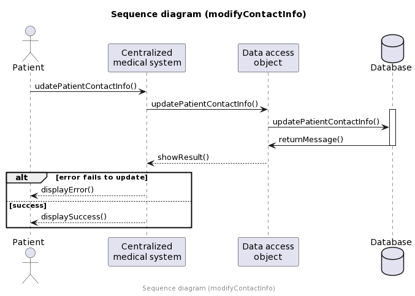
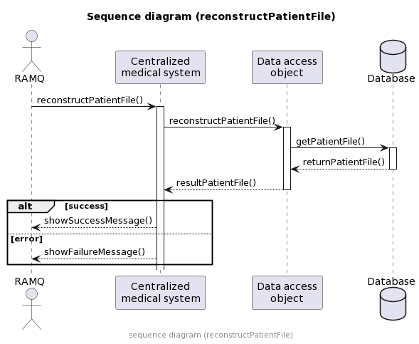
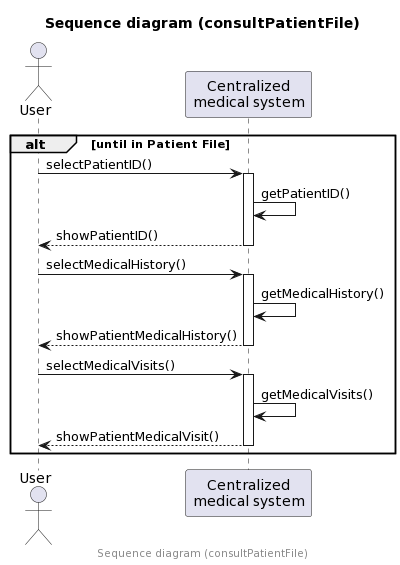
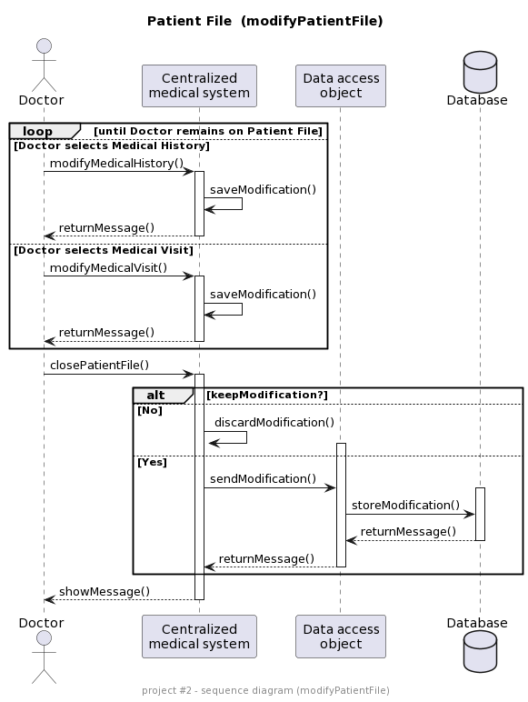

# PAGE PRÉSENTATION

Rapport de conception projet de session

Présenté au professeur Gagnely Serge Dogny

dans le cadre du cours INF5153 Génie Logiciel: Conception

 par

Steven Chia Ah-Lan - AHLS12109105 

Alexandre Filion - FILA09128609 

Mohand Amine Saïdi - TODO

Nicolas Goulet - GOUN12109401

Travail remis le dimanche 3 juillet 2022

# TABLE DES MATIÈRES
1. Page Présentation...........................................1
2. Table des matières..........................................2
3. Introduction................................................3
4. Diagramme de classes........................................4
5. Diagramme de cas d'utilisations
6. Les diagrammes de séquence

    6.1 Login

    6.2 ConsultPatientFile

    6.3 ModifyPatientFile

   6.4 ReconstructPatientFile

    6.5 modifyContactInfo
7. Diagramme de package
8. Diagramme de composantes
9. Diagramme de déploiement

# Introduction

# Diagramme de classes
EXPLICATION DIAGRAMME DE CLASSE TODO

## Justfications GRASP

### PatientRegistry et DoctorRegistry
Ces deux classes jouent le rôle de conteneurs d'information ; `PatientRegistry` est composé de dossiers de patients, 
et `DoctorRegistry` est composé de médecins. Nous utilisons le patron *Créateur* vu que nous observons 
une relation de composition. Par conséquent, `PatientRegistry` et `DoctorRegistry` ont la responsabilité
d'instancier les dossiers des patients et les médecins, respectivement.  

### PatientFile

Nous utilisons le patron de *Spécialiste de l'information* pour justifier l'instanciation de la classe PatientFile. 
Cette classe a pour responsabilité d'aller récupérer toutes les informations pertinentes relatives au dossier d'un patient, 
notamment les visites et antécédents médicaux de ce dernier. Nous évitons ainsi un gros BLOB.

ou sinon

Nous utilisons le patron *Créateur* pour justifier l'instanciation de la classe PatientFile. Étant
composé de visites médicaux et d'antécédents médicaux, cette classe a pour responsabilité de créer des
instances des classes `MedicalHistory` et `MedicalVisit`. 

### MedicalHistory et MedicalVisit
Nous utilisons le patron de *Spécialiste de l'information* pour justifier l'instanciation de ces
deux classes. `MedicalHistory` et `MedicalVisit` ont pour responsabilité d'aller récupérer toutes
les informations par rapport aux visites médicales et aux antécédents médicaux, respectivement. 
En encapsulant ces informations dans deux classes distinctes, nous évitons ainsi de créer un gros BLOB.

### User
-`User` englobe les utilisateurs qui auraient accès au système centralisé de gestion des dossiers médicaux.
Le patron *Polymorphisme* est utilisé ici, car les classes qui héritent de `User` possèdent des comportements
dont leur implémentation diffère selon la sous-classe. Un patient ne modifie pas le dossier de la même
façon qu'un médecin, par exemple.

### Doctor
-`Doctor` a le devoir de gérer le dossier médical, par exemple en ajoutant des visites ou des antécédents. 
Le patron *Faible couplage* justifie son instanciation, car le `Doctor` possède un couplage faible avec
le `PatientFile`. Effectivement, le `PatientFile` est passé en tant que paramètre dans les méthodes
privées de `Doctor` au lieu d'avoir une relation directe avec ce dernier, ce qui affaiblit le couplage entre ces
deux classes. 

### HealthProfessional
-`HealthProfessional` est une classe abstraite qui respecte le principe ouvert/fermé. Cette classe
contient une implémentation de la méthode `consult()` permet la consultation d'un dossier médical.
L'ajout d'un travailleur de la santé en tant que sous-classe de `HealthProfessional` permettrait
à cette classe d'hériter du comportement de lecture du dossier médical d'un patient. Par conséquent, 
le patron utilisé est le *Polymorphisme*. 

### Patient
-`Patient` est une classe dont l'instanciation est justifiée par le patron *Forte cohésion*. En effet,
cette classe contient un petit nombre de méthodes qui ont des responsabilités liées entre elles ; 
la consultation et la modification sont toutes deux des fonctions liées à la gestion de certaines
données du patient dans le système (dans ce cas-ci, les coordonnées du patient). 

ou sinon

-`Patient` est une classe dont l'instanciation est justifiée par le patron *Spécialiste de l'information*. 
En effet, cette classe encapsule les données du patient dans le système et inclut des méthodes pour gérer certaines 
de ces données. Notamment, `Patient` connaît `ContactInformation`, et la consultation et la modification sont 
toutes deux des fonctions qui permettent au patient de voir et de modifier ses coordonnées dans le système. 

### MedicalEstablishment
-`MedicalEstablishment` est une classe qui contient les informations liées à un établissement
médical. L'information étant encapsulée dans `MedicalEstablishment`, cette classe joue le rôle
de *Spécialiste de l'information*, car elle permet de maintenir un faible couplage dans le code.

public String getAddress()?
Pour avoir accès aux coordonnées sans les modifier. 

### ContactInformation
`ContactInformation` est une classe dont l'instanciation est justifiée par le patron *Fabrication pure*. 
Effectivement, c'est une classe créée artificiellement pour gérer les informations relatives aux 
coordonnées (d'un patient ou d'un établissement médical par exemple). 

### Searchable
L'interface `Searchable` permet de faire une recherche dans une collection de données en passant
un critère de données. 

### Modifiable

#### Justification de la méthode public X
Lorem ipsum dolor sit amet, consectetur adipiscing elit, sed do eiusmod tempor incididunt ut labore et dolore magna aliqua. Ut enim ad minim veniam, quis nostrud exercitation ullamco laboris nisi ut aliquip ex ea commodo consequat. Duis aute irure dolor in reprehenderit in voluptate velit esse cillum dolore eu fugiat nulla pariatur. Excepteur sint occaecat cupidatat non proident, sunt in culpa qui officia deserunt mollit anim id est laborum.

# Diagramme des cas d'utilisation 

Explication du diagramme des cas d'utilisation pour le système de gestion de dossiers médicaux :
-Le patient peut consulter son dossier (de manière limitée) ainsi que modifier
ses informations de contact (comme ses coordonnées).
-La RAMQ peut en tout temps reconstruire le dossier d'un patient à partir d'une date
donnée.
-Les professionnels de la santé peuvent tous consulter les dossiers des patients, mais
seuls les médecins peuvent y apporter des modifications. Nous considérons que pour le
médecin, la modification d'un dossier doit être obligatoirement précédée par sa consultation.
-Toutes les actions doivent être précédées d'une authentification.
-L'acteur 'OtherHealthProfessionals' est inclus pour illustrer le fait que les autres
professionnels de la santé (pharmacien, infirmiers, etc.) peuvent consulter le dossier du patient.

# Diagrammes de séquences 

Chaque diagramme de séquence représente un cas d'utilisation à
haut niveau. Nous faisons abstraction des détails d'implémentation afin
d'illustrer la fonctionnalité à une haute granularité.

Définition  
User : tout utilisateur du système (sauf si spécifié)  
Centralized medical system : le système qui permet de naviguer dans un dossier médical d'un patient  
Data access object : interface qui communique avec la base de données  
Database : la base de données qui centralise tous les dossiers médicaux des patient

login  
Ce diagramme illustre la fonctionnalité d'authentification à haut niveau.
L'utilisateur interagit avec le système en entrant ses identifiants. Le système communique
par la suite avec la base de données pour valider l'authentification. Le profile
de l'utilisateur est affiché en cas de succès. En cas d'échec, un message d'erreur est affiché.

modifyContactInfo  
Ce diagramme illustre la fonctionnalité de modification des coordonnées d'un patient par lui-même. Le patient peut
modifier ses coordonnées en entrant dans le système les nouvelles coordonnées. Le système s'occupe de mettre-à-jour
les coordonnées du patient dans la base de données. En cas de succès, un message de succès et affiché. En cas d'échec,
un message d'erreur est affiché.

reconstructPatientFile  
Ce diagramme illustre la fonctionnalité de reconstruire le dossier médical d'un patient à partir d'une date donnée ou
d'une modification faite dans le passé. L'utilisateur RAMQ entre les informations nécessaires dans le système et
ce dernier envoie ces informations à l'interface. En cas de succès, un message de succès et affiché.
En cas d'échec, un message d'erreur est affiché.

consultPatientFile  
Ce diagramme illustre la fonctionnalité de consultation d'un dossier médical d'un patient par un utilisateur.
La consultation inclus les informations suivantes du patient : son identité, ses antécédents médicaux
et ses visites médicales. L'utilisateur demande au système quel aspect du dossier médical il désire consulter
et cela va s'afficher à l'écran.

modifyPatientFile  
Ce diagramme illustre la fonctionnalité de modification d'un dossier médical d'un patient par le docteur. Selon le
choix du docteur, il peut ajouter ou retirer une modification d'un dossier médical d'un patient.
Lors d'une modification, le système la garde en mémoire jusqu'à temps que le docteur quitte le dossier du patient. 
Par  la suite le système affiche un message au docteur s'il veut sauvegarder ou non les modifications. Si oui, elles
sont envoyées dans la base de données, sinon elles sont éliminées.

## Login