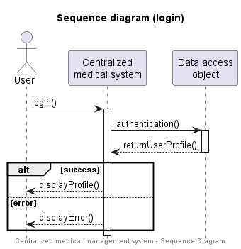
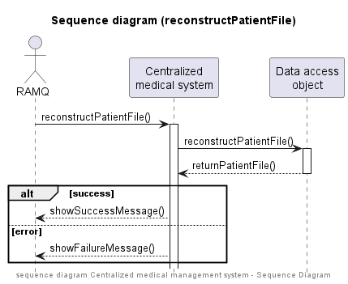
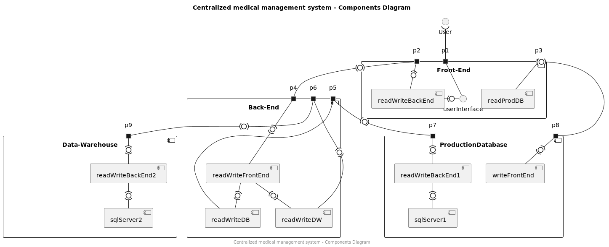

# PAGE DE PRÉSENTATION
  
  
  
  

Rapport de conception projet de session

Présenté au professeur Gagnely Serge Dogny

dans le cadre du cours INF5153 Génie Logiciel: Conception

  
  
  
  

 par
  
  
  
  

Steven Chia Ah-Lan - AHLS12109105

Alexandre Filion - FILA09128609

Mohand Amine Saïdi - SAIM15029603

Nicolas Goulet - GOUN12109401

  
  
  
  
  
  
  
  

Travail remis le dimanche 3 juillet 2022

# TABLE DES MATIÈRES
  
  
  
  
1. Diagramme de classes
     
   1.1 Justifications des patrons GRASP   
     
     
   
2. Diagramme de cas d'utilisations
     
     

3. Les diagrammes de séquence
     
    3.1 login
     
    3.2 modifyContactInfo
     
    3.3 reconstructPatientFile
     
    3.4 consultPatientFile
     
    3.5 modifyPatientFile
     
     
4. Diagramme de package
     
     
5. Diagramme de composantes
     
     
6. Diagramme de déploiement

# 1. Diagramme de classes

##1.1 Justfications des patrons GRASP

### PatientRegistry et DoctorRegistry
-Ces deux classes représentent des conteneurs d'information dans le système, puisqu'elles pourraient 
faire partie d'une base de données par exemple.`PatientRegistry` contient les dossiers des patients, 
et `DoctorRegistry` contient les informations sur les docteurs. Nous utilisons le patron *Créateur* vu 
que nous observons une relation de composition. En implémentant l'interface `Registry`, les clases `PatientRegistry` 
et `DoctorRegistry` permettent l'instanciation des dossiers patients et des médecins, respectivement. 
L'implémentation de l'interface `Searchable` permet aussi la recherche dans une collection de données.

### PatientFile

-Nous utilisons le patron *Créateur* pour justifier l'instanciation de la classe PatientFile. Étant
composé de visites médicales et d'antécédents médicaux, cette classe a pour responsabilité de créer des
instances des classes `MedicalHistory` et `MedicalVisit`. 

### MedicalHistory et MedicalVisit
-Nous utilisons le patron de *Spécialiste de l'information* pour justifier l'instanciation de ces
deux classes. `MedicalHistory` et `MedicalVisit` ont pour responsabilité d'aller récupérer toutes
les informations par rapport aux visites médicales et aux antécédents médicaux, respectivement. 
En encapsulant ces informations dans deux classes distinctes, nous évitons ainsi de créer un gros BLOB.
 
-`MedicalHistory` et `MedicalVisit` contiennent chacune une méthode publique (accesseur) qui retourne
le `MedicalHistory` et `MedicalVisit` respectivement à des fins de consultation. Vu que ces dernières 
ne contiennent pas de référence vers d'autres objets (faible couplage), ces accesseurs retournent 
l'information sans créer de problèmes de fuite de données ou d'intimité inappropriée. 

### User
-`User` englobe les utilisateurs qui auraient accès au système centralisé de gestion des dossiers médicaux.
Le patron *Polymorphisme* est utilisé ici, car les classes qui héritent de `User` possèdent des comportements
dont leur implémentation diffère selon la sous-classe. Un patient ne consulte pas le dossier de la même
façon qu'un médecin, par exemple. Les détails de l'implémentation restent cachés dans les sous-classes
de `User`. 

### Doctor
-`Doctor` a le devoir de gérer le dossier médical. Par conséquent, cette classe se comporte en 
consultant le dossier ou en y apportant des modifications. Le patron *Faible couplage* justifie son 
instanciation, car le `Doctor` possède un couplage faible avec le `PatientFile`. Effectivement, le 
`PatientFile` est passé en tant que paramètre dans les méthodes de `Doctor` au lieu d'avoir 
une relation directe avec ce dernier, ce qui affaiblit le couplage entre ces deux classes. 

-La méthode `modify()` est publique car `Doctor` implémente l'interface `Modifiable`, qui permet
aux classes qui la réalisent d'apporter des modifications à des objets. Les détails de ces 
modifications sont cachés dans l'implémentation spécifique de `modify()` propre à chaque classe.
Par exemple, un `Doctor` sait modifier un `PatientFile` en y ajoutant des visites médicales, 
un `Patient` sait modifier le `PatientFile` en modifier ses coordonnées, et le `RAMQEmployee`
sait modifier le `PatientFile` en le reconstruisant à partir d'une date donnée. 

### HealthProfessional
-`HealthProfessional` est une classe abstraite qui respecte le principe ouvert/fermé. Cette classe
contient une implémentation de la méthode `consult()` qui permet la consultation d'un dossier médical.
L'ajout d'un travailleur de la santé en tant que sous-classe de `HealthProfessional` permettrait
à cette classe d'hériter du comportement de lecture du dossier médical d'un patient. Par conséquent, 
le patron utilisé est le *Polymorphisme*. 

### Patient et RAMQEmployee
-`Patient` et `RAMQEmployee` sont des classes qui héritent de `User` et qui implémentent `Modifiable`. 
Leur instanciation est justifiée par le patron *Forte cohésion*. En effet, ces classes contiennent par 
héritage un petit nombre de méthodes avec des responsabilités spécifiques, mais cohésives. Notamment,
pour apporter des modifications à un dossier, il faut d'abord pouvoir le consulter, en partie ou
en totalité. Les détails des modifications que le `Patient` et le `RAMQEmployee` peuvent apporter
sont cachés dans l'implémentation de la méthode `modify()`, qui demeure publique à cause de 
la réalisation du contrat `Modifiable`. 

### RAMQEmployee
-`RAMQEmployee` est une classe qui hérite de `User` et qui implémente `Modifiable`. Son instanciation 
est justifiée par le patron *Forte cohésion*. En effet, cette classe contient par héritage un petit 
nombre de méthodes qui ont des responsabilités liées entre elles ; la consultation et la modification 
sont toutes deux des fonctions liées à la gestion de certaines données du patient dans le système 
(dans ce cas-ci, les coordonnées du patient). 

### MedicalEstablishment
-`MedicalEstablishment` est une classe qui contient les informations liées à un établissement
médical. L'information étant encapsulée dans `MedicalEstablishment`, cette classe joue le rôle
de *Spécialiste de l'information*, car elle permet de maintenir un faible couplage dans le code.

### ContactInformation
-`ContactInformation` est une classe dont l'instanciation est justifiée par le patron *Fabrication pure*. 
Effectivement, c'est une classe créée artificiellement pour gérer les informations relatives aux 
coordonnées (d'un patient ou d'un établissement médical par exemple). Cette classe contient un
accesseur publique qui retourne les informations de contact sans exposer des objets de manière
inappropriée, car `ContactInformation` ne contient pas de référence vers d'autres objets.

# 2. Diagramme des cas d'utilisation 

### Explication du diagramme des cas d'utilisation pour le système de gestion de dossiers médicaux :
-Le patient peut consulter son dossier (de manière limitée) ainsi que modifier
ses informations de contact (comme ses coordonnées).

-La RAMQ peut en tout temps reconstruire le dossier d'un patient à partir d'une date
donnée.

-Les professionnels de la santé peuvent tous consulter les dossiers des patients, mais
seuls les médecins peuvent y apporter des modifications. Nous considérons que pour le
médecin, la modification d'un dossier doit être obligatoirement précédée par sa consultation.

-Toutes les actions doivent être précédées d'une authentification.

-L'acteur 'OtherHealthProfessionals' est inclus pour illustrer le fait que les autres
professionnels de la santé (pharmacien, infirmiers, etc.) peuvent consulter le dossier du patient.

# 3. Diagrammes de séquences 

Chaque diagramme de séquence représente un cas d'utilisation à
haut niveau. Nous faisons abstraction des détails d'implémentation afin
d'illustrer la fonctionnalité à une haute granularité.

## Définitions  
- User : tout utilisateur du système (sauf si spécifié)  
- Centralized medical system : le système qui permet de naviguer dans un dossier médical d'un patient  
- Data access object (DAO) : interface qui communique avec la base de données. Le DAO est une couche qui gère l'accès à la base de données, afin de ne pas coupler les requêtes
  SQL avec l'application. L'application demande au DAO de lui fournir les informations qui se trouvent dans la base de données. C'est donc la DAO qui se charge de faire les requêtes vers la base de données, de sorte que si on change de système de base de données,
  l'application en tant que telle n'est pas affectée. 
- Database : la base de données qui centralise tous les dossiers médicaux des patients

## 3.1 login  
Ce diagramme illustre la fonctionnalité d'authentification à haut niveau.
L'utilisateur interagit avec le système en entrant ses identifiants. Le système communique
par la suite avec la base de données pour valider l'authentification. Le profile
de l'utilisateur est affiché en cas de succès. En cas d'échec, un message d'erreur est affiché.

## 3.2 modifyContactInfo  
Ce diagramme illustre la fonctionnalité de modification des coordonnées d'un patient par lui-même. Le patient peut
modifier ses coordonnées en entrant dans le système les nouvelles coordonnées. Le système s'occupe de mettre-à-jour
les coordonnées du patient dans la base de données. En cas de succès, un message de succès et affiché. En cas d'échec,
un message d'erreur est affiché.

## 3.3 reconstructPatientFile  
Ce diagramme illustre la fonctionnalité de reconstruire le dossier médical d'un patient à partir d'une date donnée ou
d'une modification faite dans le passé. L'utilisateur RAMQ entre les informations nécessaires dans le système et
ce dernier envoie ces informations à l'interface. En cas de succès, un message de succès et affiché.
En cas d'échec, un message d'erreur est affiché.

## 3.4 consultPatientFile  
Ce diagramme illustre la fonctionnalité de consultation d'un dossier médical d'un patient par un utilisateur.
La consultation inclus les informations suivantes du patient : son identité, ses antécédents médicaux
et ses visites médicales. L'utilisateur choisit quel aspect du dossier sera affiché à l'écran par le système. 

## 3.5 modifyPatientFile  
Ce diagramme illustre la fonctionnalité de modification d'un dossier médical d'un patient par le docteur. Selon le
choix du docteur, il peut ajouter ou retirer une modification d'un dossier médical d'un patient.
Lors d'une modification, le système la garde en mémoire jusqu'à temps que le docteur quitte le dossier du patient. 
Par  la suite le système affiche un message au docteur s'il veut sauvegarder ou non les modifications. Si oui, elles
sont envoyées dans la base de données, sinon elles sont éliminées.

# 4. Diagramme de packages

Le diagramme de packages est une représentation haut niveau (sans attributs ni méthodes) qui regroupe 
les classes de notre système. Les paquets sont nommés afin de catégoriser les classes qui y sont contenues. 
Par exemple, le paquet `User` regroupe les utilisateurs du système, comme les médecins et les patients.
Un paquet supplémentaire (`UserInterface`) est représenté dans ce diagramme pour regrouper les
classes qui se chargeront d'implémenter l'interface utilisateur. La séparation entre les paquets se
fait naturellement à partir du diagramme de classes. Effectivement, les paquets se lient par leurs
classes de la même manière que les classes se lient entre elles dans le diagramme de classes.

# 5. Diagramme de composantes

Il est à noter pour ce diagramme que nous avons fait le choix de représenter les interfaces entre les composantes comme se consommant
des deux côtés, puisque doubler le nombre de ports dans le diagramme (un pour chaque entrée, un pour chaque sortie)
rendait lourde et difficile la lecture du diagramme.

Notre application sera composée des composantes suivantes :

- Le front-end, qui traite l'information fournie par l'utilisateur. Selon les besoins, le front-end 
fera des requêtes en lecture à la base de données ou des requêtes au back-end, et affichera
à l'utilisateur l'information fournie par le back-end.

- Le back-end, qui traite les requêtes fournies par le front-end. Selon les requêtes, le back-end fera des requêtes 
en écriture ou en lecture à la base de données ou à la data warehouse. Le back-end pourra ensuite fournir les résultats
des requêtes au front-end pour affichage à l'utilisateur. Une copie de chaque requête en écriture fait à la base de données
est envoyé à la data warehouse.

- La base de données, qui traite les requêtes en écriture et lecture du back-end ainsi que les requêtes du front-end en 
lecture du front-end. C'est elle qui contient l'état actuel des dossiers médicaux des patients.

- La data warehouse, qui contient l'historique des modifications de la base de données. Elle peut fournir au back-end
l'information nécessaire pour faire basculer à un état antérieur la base de données.

# 6. Diagramme de déploiement

Pour le déploiement de notre application, nous devrons garder actif au moins quatre serveurs 
(front-end, back-end, base de données, data warehouse). Ces serveurs assureront
un service en continu aux utilisateurs, qu'ils soient sur leur téléphone intelligent ou leur ordinateur.

Le déploiement de notre application sera assuré par :

1. La machine individuelle d'un utilisateur, qu'il s'agisse d'un téléphone intelligent
   ou d'un ordinateur pourvu que la machine soit munie d'un fureteur.

2. Le front-end, qui permet l'utilisation de notre application par l'utilisateur au travers d'une interface.

3. Le back-end, qui assure la communication avec les bases de données.

4. La base de données, qui contient les dossiers médicaux des patients.

5. La data warehouse, qui contient l'historique des modifications de la base de données.